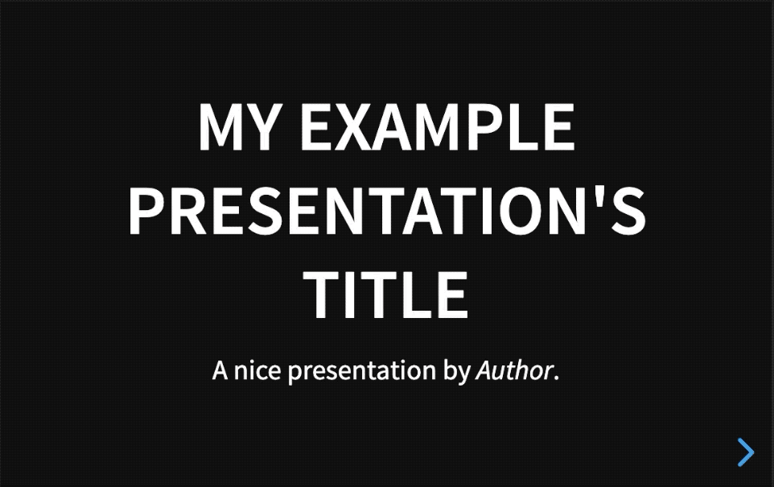
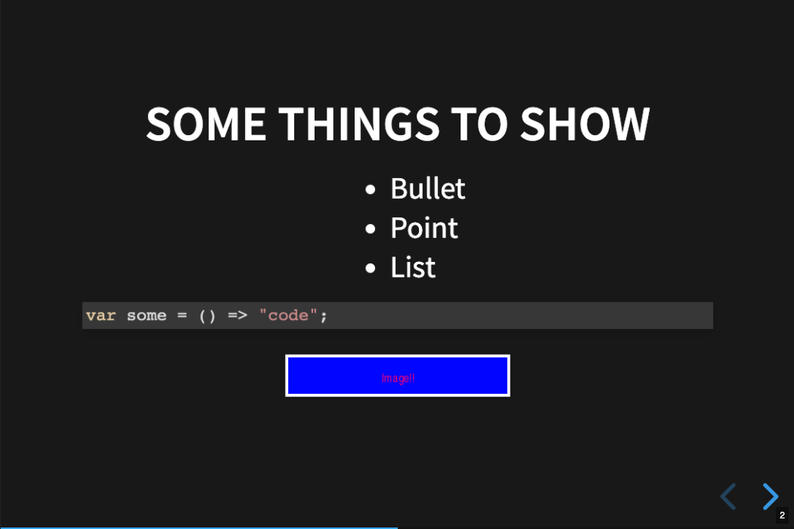
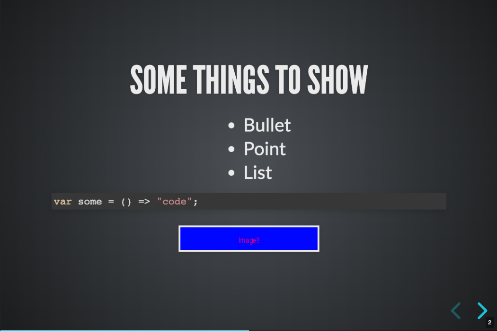
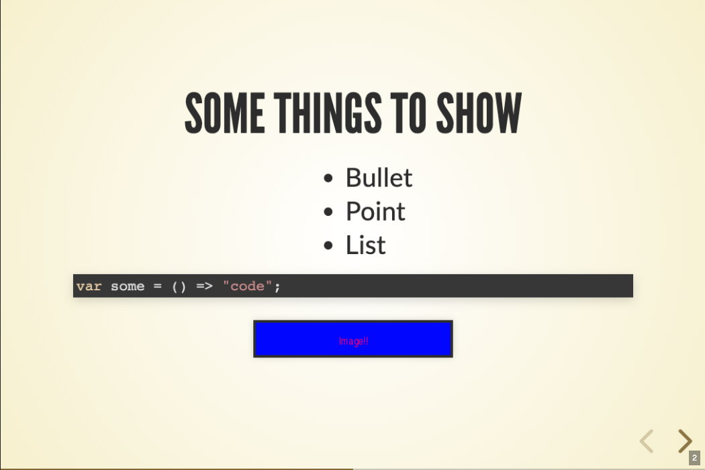
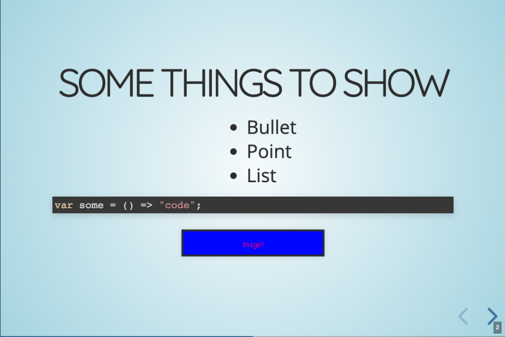
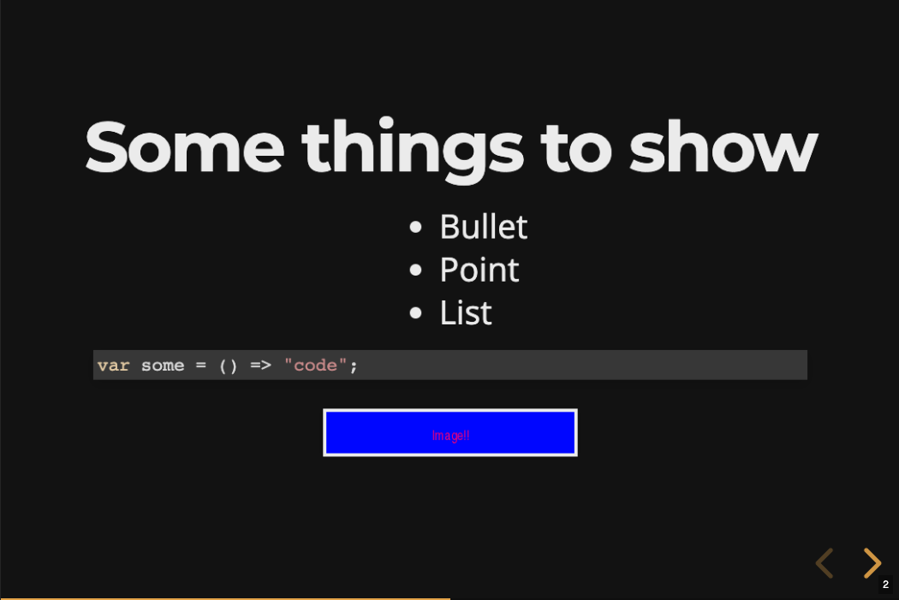
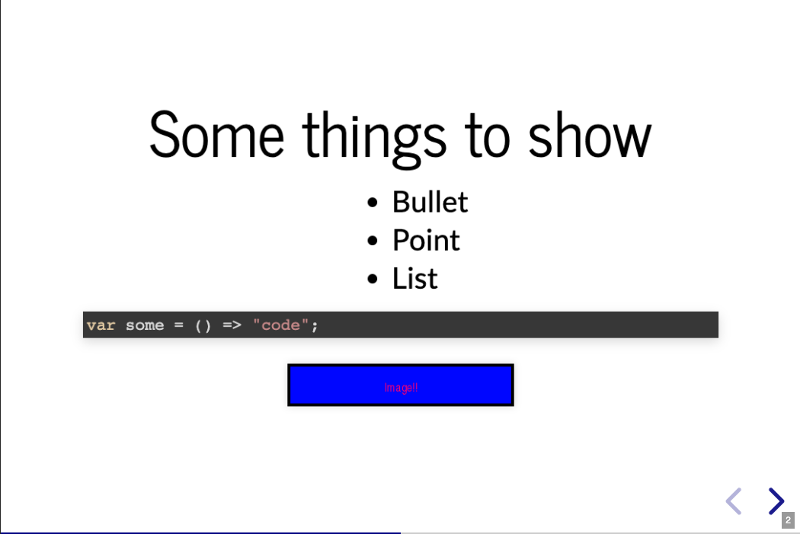
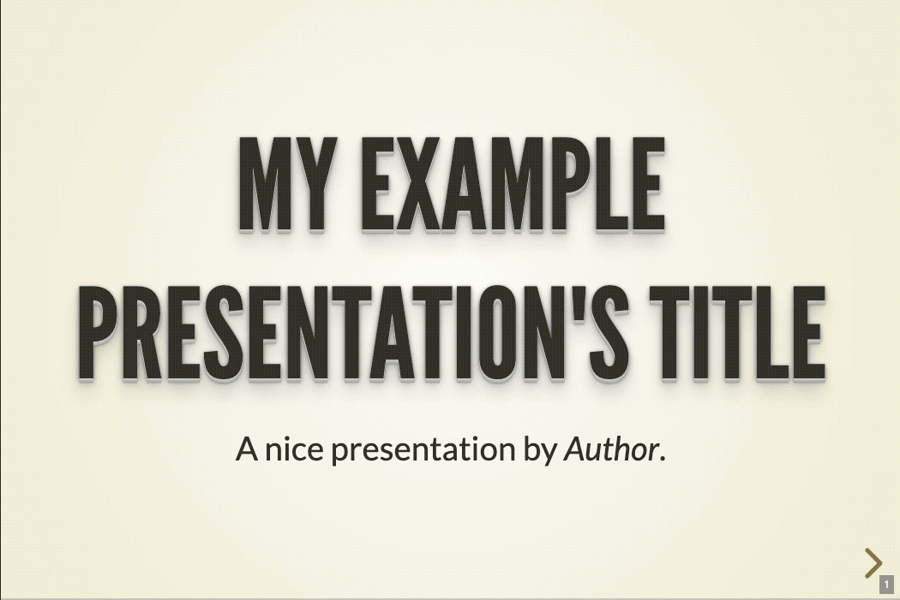
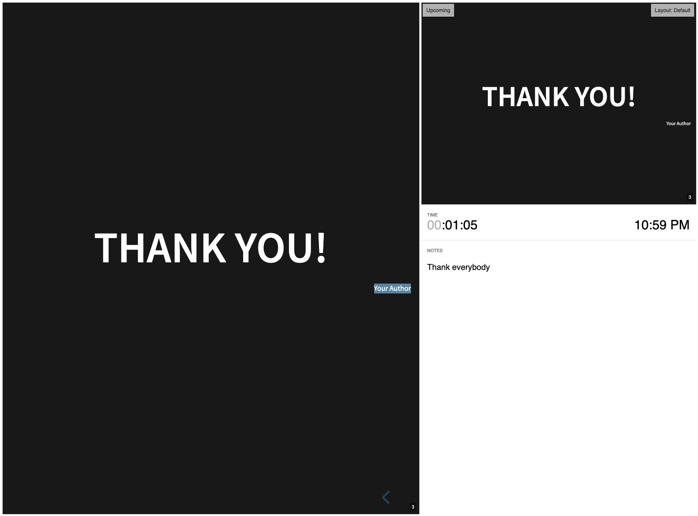

It's hard to imagine today's office workspaces without slide-deck presentations somewhere in the background. Whether it's marketing slides presented to some customer, or structured arguments to facilitate an internal discussion with colleagues; slides are hard to avoid. But sometimes MS Powerpoint can really feel like overkill, especially if it's on the lower, more internal end of the spectrum. In addition, it can get quite annoying if you want to show some properly formatted source code. You may typically end up spending more time on the styling and layout than on the the content itself. What if we could create slides as easily as we write articles (like the one you are reading right now) and documentation? In markdown!

**Enter:** [reveal-md](https://github.com/webpro/reveal-md)

**Let's jump straight in**, and look at more details afterwards.

## Get started in 3 minutes

### 1. Prerequisites:

1. Install [Node.js](https://nodejs.org/) to get `npm` and `npx`
2. Install Editor like [Microsoft's Visual Studio Code](https://code.visualstudio.com/)

### 2. Setup

1. Create new `.md` file and open in editor.

    ```bash
    $ code Example.md
    ```

2. Download and execute reveal-md, pointing it to your presentation file.

    - a) **Without installation** using `npx`:
        ```bash
        $ npx reveal-md Example.md --port 7742 --watch
        ```
        **or**
    - b) **With global installation** using `npm`:

        ```bash
        # Install globally once
        $ npm install -g reveal-md
        # Afterwards simply run as follows
        $ reveal-md Example.md --port 7742 --watch
        ```

        This will serve the slideshow presentation at `localhost:7742` and should automatically open your browser. You should see an empty presentation screen.

### 3. Add some slides

Now go **back to your editor** and **add some simple slides** to your presentation.

1. Start with a **title slide**, just as you would in a regular markdown document:

    ```markdown
    # My Example Presentation's Title

    A nice presentation by _Author_.
    ```

2. Add a **slide separator**:
    ```markdown
    ---
    ```
3. Create a **content slide**:

    ````markdown
    ## Some things to show

    -   Bullet
    -   Point
    -   List

    ```js
    var some = () => "code";
    ```

    
    ````

4. Add another **slide separator**:
    ```markdown
    ---
    ```
5. Add a **Thank You slide**.

    ```markdown
    # Thank You!

    <div style="font-size: 18px; text-align: right;">
        Your Author
    </div>
    ```

6. **Complete example**. All three slides together in 25 lines of markdown.

    ````markdown
    # My Example Presentation's Title

    A nice presentation by _Author_.

    ---

    ## Some things to show

    -   Bullet
    -   Point
    -   List

    ```js
    var some = () => "code";
    ```

    

    ---

    # Thank You!

    <div style="font-size: 18px; text-align: right;">
        Your Author
    </div>
    ````

    

## Additional Options

A comprehensive list of features can be found on [reveal-md's GitHub page](https://github.com/webpro/reveal-md).
I will describe a selected few below.

### Configuration in YAML front matter

There are multiple ways to configure reveal-md (or the underlying reveal.js) and style your presentations. Some options can be passed as command-line parameters, or put into a json file.

My preferred way, however, is to configure the options through some lines of YAML at the beginning of the Markdown document.

**Example**

```yaml
---
title: Yet Another Presentation I Have To Give
separator: ---
theme: black
revealOptions:
    transition: "slide"
---

```

### Themes

Reveal.js comes with multiple themes. The following themes may be specified with the `theme` property.

-   ```yaml
    theme: black
    ```
    
-   ```yaml
    theme: white
    ```
    
-   ```yaml
    theme: moon
    ```
    
-   ```yaml
    theme: league
    ```
    
-   ```yaml
    theme: beige
    ```
    
-   ```yaml
    theme: sky
    ```
    
-   ```yaml
    theme: night
    ```
    
-   ```yaml
    theme: serif
    ```
    
-   ```yaml
    theme: simple
    ```
    
-   ```yaml
    theme: solarize
    ```
    
-   ```yaml
    theme: blood
    ```
    

### Transition Style

Reveal.js comes with multiple transition styles. The following themes may be specified with the `transition` sub-property of the `revealOptions` property.

-   ```yaml
    revealOptions:
        transition: none
    ```
    
-   ```yaml
    revealOptions:
        transition: fade
    ```
    
-   ```yaml
    revealOptions:
        transition: slide
    ```
    
-   ```yaml
    revealOptions:
        transition: convex
    ```
    
-   ```yaml
    revealOptions:
        transition: concave
    ```
    
-   ```yaml
    revealOptions:
        transition: zoom
    ```
    

### Full Page Pictures / Background

Add background images with `<!-- .slide: data-background="URL" -->`.

```md
---

<!-- .slide: data-background="https://example.com/image.jpg" -->

# Thank You!

<div style="font-size: 18px; text-align: right;">
    Your Author
</div>
```


Image Credits: [maxpixel.net](https://www.maxpixel.net/static/photo/1x/Water-Lake-Sky-Nature-Quiet-Scenery-Landscape-4620023.jpg)

### Speaker Notes

Add some speaker notes after `Note:`. The notes can be seen in speaker view. Open speaker view by pressing the `s` key on the keyboard.

```md
---

# Thank You!

<div style="font-size: 18px; text-align: right;">
    Your Author
</div>

Note: Thank everybody
```



### Quotes

Text after a `>` will be shown as a quote.

```Markdown
---

> Bourbon.
>
> When I drink bourbon I get weirdly good at beatboxing.
```


### Vertical vs Horizontal Slide Navigation

Please go on, there is nothing to see here!

Still here? Ok, so: `Reveal.js` offers two dimensions of navigation: _vertical_ and _horizontal_. The idea is that this navigation reflects the hierarchy of the presented content.

Take this content structure as an example:

-   Topic 1
    -   Sub-topic 1.1
    -   Sub-topic 1.2
    -   Sub-topic 1.3
-   Topic 2
    -   Sub-topic 2.1
    -   Sub-topic 2.2
-   Topic 3

A horizontal navigation would switch between topics 1 to 3, whereas a vertical navigation would move from a slide for Topic 1 to slides for sub-topics 1.1 to 1.3.

Well... I think, this may sound very nice in theory. In practice, I have never seen it working well. It's just too hard for the audience to follow a two-dimensional structure.

So, I don't like it. Please don't do it. Get your goals and ideas clear, and build a **linear story** around it. Your audience will\* thank you!

\*_They won't, because you know how people are._

## Reveal.js

`Reveal-md` internally uses and builds on top of [`reveal.js`](https://revealjs.com/#/) which is a library/tool/framework to build slideshows in html.

For further documentation on features and configuration options, see [`reveal.js` on GitHub](https://github.com/hakimel/reveal.js).
